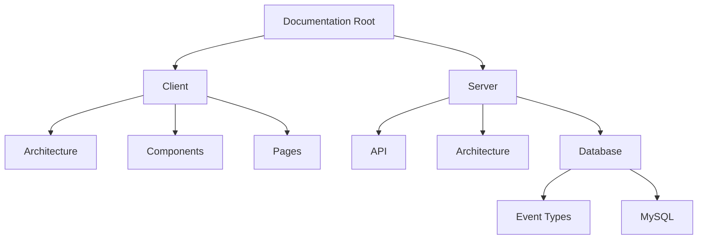

# What's Fresh Documentation

## Project Structure

### Client Documentation (`/client`)
- **architecture/** - System design and patterns
  - State management
  - Event system
  - Authentication flow
- **components/** - Reusable component specifications
  - CRUD operations
  - Common components
- **pages/** - Page-specific flows and implementations

### Server Documentation (`/server`)
- **api/** - API endpoints and protocols
- **architecture/** - Backend system design
- **database/** 
  - [Database Schema](./server/database/MySQL.mmd)
  - Event types
  - Schema design
  - Stored procedures

## Quick Navigation
- [Client Architecture](./client/architecture/)
- [Server Database](./server/database/)
- [API Documentation](./server/api/)

1. Create new documentation:
   - Follow existing templates
   - Use Markdown formatting
   - Include Mermaid diagrams where helpful