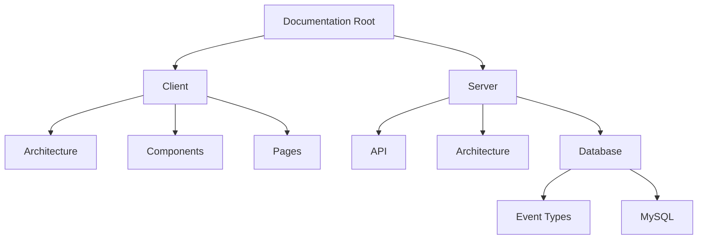

# WhatsFresh Documentation

## Project Structure


## Quick Navigation
- [Client Architecture](./client/architecture/)
- [Server Database](./server/database/)
- [API Documentation](./server/api/)

## Documentation Guidelines
1. Use Markdown (`.md`) for text documentation
2. Use Mermaid for diagrams and flows
3. Keep documentation close to related code
4. Update documentation with code changes

## Getting Started
To preview documentation:
1. Press `Ctrl+Shift+V` to open preview
2. For Mermaid diagrams, ensure preview is enabled

## Contributing to Documentation

### Setup
1. Clone the repository:
   ```bash
   git clone https://github.com/pchambless/whatsresh-docs.git
   ```
2. Install recommended VS Code extensions:
   - Markdown All in One
   - Markdown Preview Mermaid Support

### Making Changes
1. Create a new branch for your changes:
   ```bash
   git checkout -b docs/your-feature-name
   ```
2. Make your documentation changes
3. Commit and push your changes
4. Create a pull request

### Documentation Standards
- Use descriptive commit messages
- Keep changes focused and atomic
- Update table of contents when adding new sections
- Test all internal links before committing