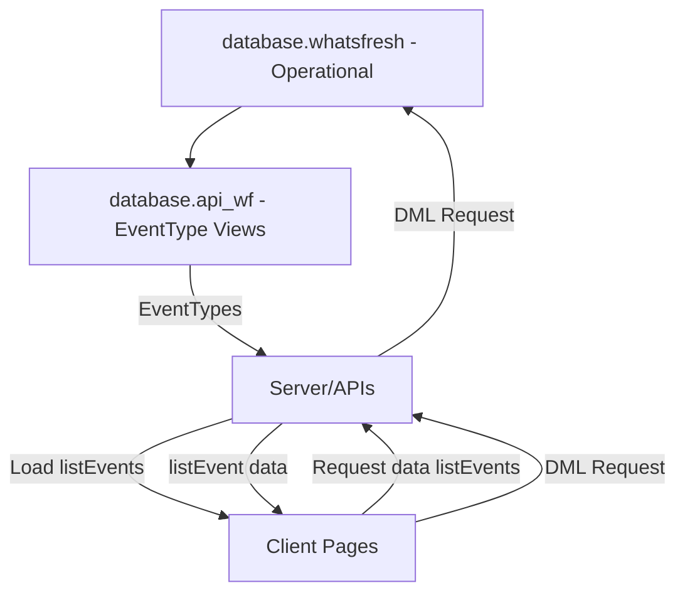

# What's Fresh Today?

#### Quick Navigation
- [What's Fresh Today?](#whats-fresh-today)
            - [Quick Navigation](#quick-navigation)
    - [Overview](#overview)
        - [Key Features](#key-features)
        - [System Architecture](#system-architecture)
    - [Project Structure and Flows](#high-level-project-structure)
        - [2. db.whatsfresh - Operational](#2-dbwhatsfresh---operational)
        - [3. db.api\_wf - dbViews](#3-dbapi_wf---dbviews)
        - [4. Server/APIs](#4-serverapis)
        - [5. Client](#5-client)
        - [6. EventType Flow](#6-eventtype-flow)
    - [Resources for Developers](#resources-for-developers)
    - [Creating New Documentation](#creating-new-documentation)

## Overview
Whatfresh is a traceability solution designed for small-scale food producers and artisanal makers. In response to the FDA's Food Traceability Final Rule, the application simplifies ingredient tracking from procurement through production—ensuring regulatory compliance without overwhelming administrative overhead.

### Key Features
- Ingredient batch tracking
- Product recipe management 
- Production batch documentation
- Automated traceability reports
- Multi-account support

### System Architecture
The application uses a multi-tier architecture:
1. **MySQL Operational Database (whatsfresh):** Stores core business data.
2. **API Database Views (api_wf):** Provides optimized views for data access.
3. **Server Processes:** Handle business logic and event management.
4. **Client Interface:** Delivers intuitive maker-focused workflows.

## High Level Project Structure
EventTypes are the drivers for the overall Whatsfresh process.  EventTypes (a.k.a. listEvents) are used to communicate between the Server and the Client.  They are currently maintained using an Appsmith App.  
**Note:**  Eventually it would be a great idea to migrate the Appsmith app to a dedicated Admin type app /repository.

### 2. db.whatsfresh - Operational

*Description:*  
This database stores the primary, operational data for WhatFresh. It uses both tables and views (to normalize data for reporting purposes).

[See Table List...](./docs/database/db_whatsfresh.md)

---

### 3. db.api_wf - dbViews
*Description:*  
This database stores API-optimized views derived from the whatsfresh database. These views provide a simplified and performance-tuned representation of the underlying data, helping to support reporting and external API consumption.

[See View List...](./docs/database/db_api_wf.md)

*Other Details to add:*  
- Overview of source-to-view mappings  
- How these views are consumed by the API layer  
- Update strategies, caching, or refresh schedules

---

### 4. Server/APIs
*Description:*  
This layer implements business logic and exposes data through APIs. It processes event data and manages traceability workflows.

**Server Components Flowchart:**

[Server Component Flowchart](./docs/server/FlowChart.md)

*Other Details to add:*  
- Overview of API endpoints  
- Event processing flow  
- Integration with database views

---

### 5. Client
*Description:*  
The client interface delivers maker-focused workflows with interactive screens for traceability tasks.

*Details to add:*  
- UI overview  
- Key components and page flows  
- How the client consumes data from the server APIs

---

### 6. EventType Flow

Below is the detailed **EventType** flow diagram showing how data flows from the source tables to EventType views and then into the server. The EventTypes are then loaded and utilized in the Client Page processes.

- [EventType Dataflow](./docs/dataFlow.md)

---

## Resources for Developers
This documentation is primarily intended for developers interested in contributing to or understanding the internals of Whatfresh.

- **wf-server Repository:** [https://github.com/pchambless/wf-server](https://github.com/pchambless/wf-server)
- **wf-client Repository:** [https://github.com/pchambless/wf-client](https://github.com/pchambless/wf-client)
- **Appsmith App:** [https://github.com/pchambless/wf-client](https://github.com/pchambless/wf-client)

---

## Creating New Documentation
- Follow the existing templates and style.
- Use Markdown for text and Mermaid for diagrams.
- Expand each section as the project evolves.
