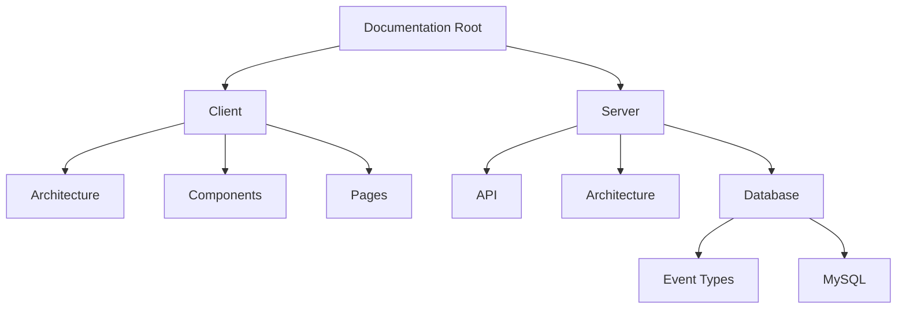

# WhatsFresh Documentation

## Project Structure

## Quick Navigation
- [Client Architecture](./client/architecture/)
- [Server Database](./server/database/)
- [API Documentation](./server/api/)

## Documentation Guidelines
1. Use Markdown (`.md`) for text documentation
2. Use Mermaid for diagrams and flows
3. Keep documentation close to related code
4. Update documentation with code changes

## Getting Started
To preview documentation:
1. Press `Ctrl+Shift+V` to open preview
2. For Mermaid diagrams, ensure preview is enabled