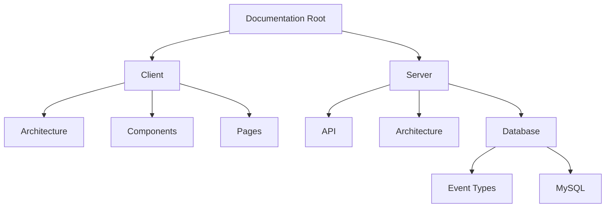

# What's Fresh Documentation

## Project Structure


### Client Documentation (`/client`)
- **architecture/** - System design and patterns
  - State management
  - Event system
  - Authentication flow
- **components/** - Reusable component specifications
  - CRUD operations
  - Common components
- **pages/** - Page-specific flows and implementations

### Server Documentation (`/server`)
- **api/** - API endpoints and protocols
- **architecture/** - Backend system design
- **database/** 
  - Event types
  - Schema design
  - Stored procedures

## Quick Navigation
- [Client Architecture](./client/architecture/)
- [Server Database](./server/database/)
- [API Documentation](./server/api/)

## Documentation Guidelines
1. Use Mermaid diagrams for visual representation
2. Include implementation status in all component docs
3. Link related documentation files
4. Keep technical specifications current

## Getting Started
1. Install required VS Code extensions:
   - Markdown Preview Enhanced
   - markdownlint

2. Clone the documentation repository:
```bash
git clone <repository-url>
cd docs
```

3. Create new documentation:
   - Follow existing templates
   - Use Markdown formatting
   - Include Mermaid diagrams where helpful

## Contributing to Documentation

### Setup
1. Clone the repository:
   ```bash
   git clone https://github.com/pchambless/whatsresh-docs.git
   ```
2. Install recommended VS Code extensions:
   - Markdown All in One
   - Markdown Preview Mermaid Support

### Making Changes
1. Create a new branch for your changes:
   ```bash
   git checkout -b docs/your-feature-name
   ```
2. Make your documentation changes
3. Commit and push your changes
4. Create a pull request

### Documentation Standards
- Use descriptive commit messages
- Keep changes focused and atomic
- Update table of contents when adding new sections
- Test all internal links before committing

## Current Focus
- [ ] Product page implementation
- [ ] CRUD component specifications
- [ ] Event system documentation
- [ ] Database schema documentation