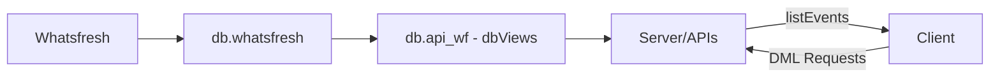
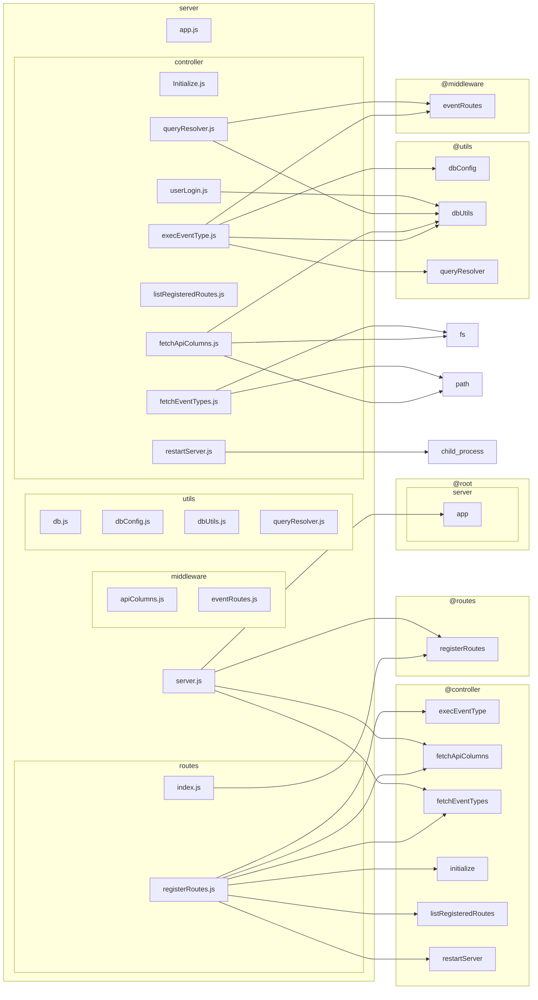
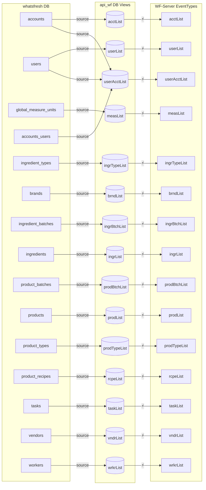

# What's Fresh Today?

## Overview
Whatfresh is a traceability solution designed for small-scale food producers and artisanal makers. In response to the FDA's Food Traceability Final Rule, the application simplifies ingredient tracking from procurement through production—ensuring regulatory compliance without overwhelming administrative overhead.

### Key Features
- Ingredient batch tracking
- Product recipe management 
- Production batch documentation
- Automated traceability reports
- Multi-account support

### System Architecture
The application uses a multi-tier architecture:
1. **MySQL Operational Database (whatsfresh):** Stores core business data.
2. **API Database Views (api_wf):** Provides optimized views for data access.
3. **Server Processes:** Handle business logic and event management.
4. **Client Interface:** Delivers intuitive maker-focused workflows.

#### Quick Navigation
- [Whatsfresh](#1-whatsfresh)
- [db.whatsfresh](#2-dbwhatsfresh)
- [db.api_wf - dbViews](#3-dbapi_wf---dbviews)
- [Server/APIs](#4-serverapis)
- [Client](#5-client)

## High Level Project Structure


---

### 1. Whatsfresh
*Description:*  
This represents the overall application and serves as the top-level entity in our architecture.

*Details to add:*  
- Application purpose  
- High-level components  
- How it interconnects with the underlying databases

---

### 2. db.whatsfresh
*Description:*  
This database stores the primary, operational data for WhatFresh. It uses both tables and views (to normalize data for reporting purposes).

*Global Tables:*
- **<span style="color:#00008B;">accounts</span>** – Stores account and customer information.
- **<span style="color:#00008B;">users</span>** – Contains maker and administrative users.
- **<span style="color:#00008B;">global_measure_units</span>** – Defines standardized measurement units.
- **<span style="color:#00008B;">accounts_users</span>** – Maps users to their accounts.

*Account Tables:*
- **<span style="color:#00008B;">brands</span>** – Lists brands for products and ingredients.
- **<span style="color:#00008B;">vendors</span>** – Stores vendor information.
- **<span style="color:#00008B;">workers</span>** – Contains data on production workers.
  
*Ingredient Tables:*
- **<span style="color:#00008B;">ingredient_types</span>** – Catalogs types of ingredients.
- **<span style="color:#00008B;">ingredient_batches</span>** – Tracks purchase and usage of ingredients.
- **<span style="color:#00008B;">ingredients</span>** – Stores detailed ingredient data.
  
*Product Tables:*
- **<span style="color:#00008B;">product_types</span>** – Classifies products.
- **<span style="color:#00008B;">tasks</span>** – Details the tasks involved with a Product Type.
- **<span style="color:#00008B;">products</span>** – Contains the list of an Account's product line.
- **<span style="color:#00008B;">product_recipes</span>** – Manages recipes and formulations.
- **<span style="color:#00008B;">product_batches</span>** – Documents production batches.

*Product Batch Mapping:*
- **<span style="color:#00008B;">product_batch_ingredients</span>** – Maps Ingredient batches to Product Batches.
- **<span style="color:#00008B;">product_batch_tasks</span>** – Details task information (steps, workers, measurements, etc.) for production.

*Other Details to add:*  
- Data sources and update frequency  
- Backup and recovery considerations

---

### 3. db.api_wf - dbViews
*Description:*  
This holds the API-optimized views derived from the whatsfresh database. These views provide a simplified and performance-tuned representation of the underlying data.

*Details to add:*  
- Overview of key views (e.g., acctList, userList, etc.)  
- Source-to-view mappings  
- How these views are used by the API layer

<details>
  <summary>View Data Flow for db.api_wf - dbViews</summary>

  ```mermaid
  graph LR
      subgraph API_WF[api_wf DB Views]
          direction LR
          acctList_view[("acctList")]
          userList_view[("userList")]
          measList_view[("measList")]
          ingrTypeList_view[("ingrTypeList")]
          brndList_view[("brndList")]
          ingrBtchList_view[("ingrBtchList")]
          ingrList_view[("ingrList")]
          prodBtchList_view[("prodBtchList")]
          prodList_view[("prodList")]
          prodTypeList_view[("prodTypeList")]
          rcpeList_view[("rcpeList")]
          taskList_view[("taskList")]
          vndrList_view[("vndrList")]
          wrkrList_view[("wrkrList")]
          userAcctList_view[("userAcctList")]
      end
  ```
</details>

---

### 4. Server/APIs
*Description:*  
This layer implements business logic and exposes data through APIs. It processes event data and manages traceability workflows.

**Server Components Flowchart:**



---

### 5. Client
*Description:*  
The client interface delivers maker-focused workflows with interactive screens for traceability tasks.

*Details to add:*  
- UI overview  
- Key components and page flows  
- How the client consumes data from the server APIs

---

## Quick Navigation
- [Client Architecture](./client/architecture/)
- [Server Database](./server/database/)
- [API Documentation](./server/api/)

---

## Data Flow
Below is the detailed database flow diagram showing how data flows from the source tables to API views and then into the server for event processing. The EventTypes generated are then utilized by the Client for various operations.



---

## Creating New Documentation
- Follow the existing templates and style.
- Use Markdown for text and Mermaid for diagrams.
- Expand each section as the project evolves.
