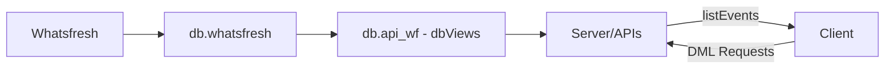
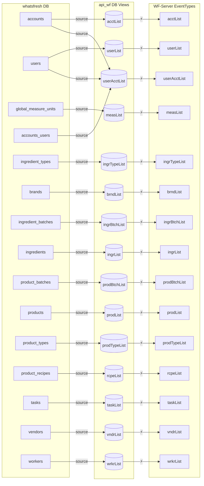

# What's Fresh Documentation

## Overview
What's Fresh is a traceability solution designed for small-scale food producers and artisanal makers. In response to the FDA's Food Traceability Final Rule, the application simplifies ingredient tracking from procurement through production, ensuring regulatory compliance without overwhelming administrative overhead.

### Key Features
- Ingredient batch tracking
- Product recipe management 
- Production batch documentation
- Automated traceability reports
- Multi-account support

### System Architecture
The application uses a multi-tier architecture:
1. **Source Database (whatsfresh):** Stores core business data.
2. **API Database (api_wf):** Provides optimized views for data access.
3. **Server Processes:** Handle business logic and event management.
4. **Client Interface:** Delivers intuitive maker-focused workflows.

## Project Structure

## Database Schema
Below is the detailed database flow diagram showing how data flows from the source tables to API views and then into the server for event processing:

## Entities

### 1. Whatsfresh
*Description:*  
This represents the overall application and serves as the top-level entity in our architecture.

*Details to add:*  
- Application purpose  
- High-level components  
- How it interconnects with the underlying databases

---

### 2. db.whatsfresh
*Description:*  
This database stores the primary, operational data for What's Fresh.

*Details to add:*  
- Key tables (e.g., accounts, users, etc.)  
- Data sources and update frequency  
- Backup and recovery considerations

---

### 3. db.api_wf - dbViews
*Description:*  
This holds the API-optimized views derived from the whatsfresh database. These views provide a simplified and performance-tuned representation of the underlying data.

*Details to add:*  
- Overview of key views (e.g., acctList, userList, etc.)  
- Source-to-view mapping  
- How these views are used by the API layer

---

### 4. Server/APIs
*Description:*  
This layer implements business logic and exposes the data through APIs. It also processes event data and manages traceability workflows.

*Details to add:*  
- API endpoints and protocols  
- Event handling flow  
- Integration with the database views and client

---

### 5. Client
*Description:*  
The client interface delivers maker-focused workflows, providing easy-to-use screens and interactive traceability tools.

*Details to add:*  
- UI overview  
- Key components and page flows  
- Data consumption from the server APIs

---

## Quick Navigation
- [Client Architecture](./client/architecture/)
- [Server Database](./server/database/)
- [API Documentation](./server/api/)

## Creating New Documentation
- Follow existing templates
- Use Markdown for text and Mermaid for diagrams
- Build out each entity section as the project evolves