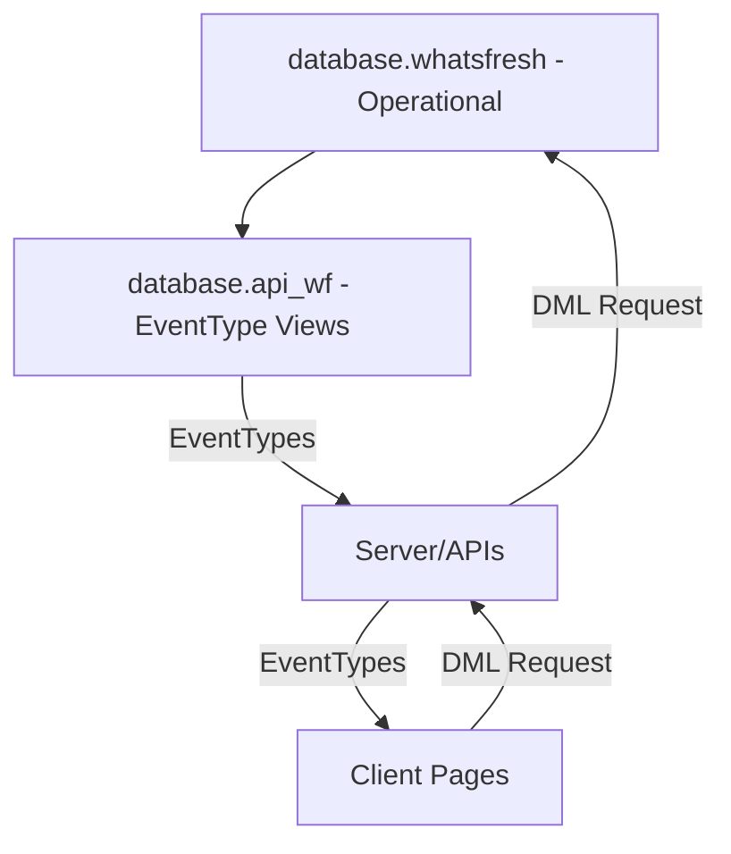

# What's Fresh Today?

## Overview
Whatfresh is a traceability solution designed for small-scale food producers and artisanal makers. In response to the FDA's Food Traceability Final Rule, the application simplifies ingredient tracking from procurement through production—ensuring regulatory compliance without overwhelming administrative overhead.

### Key Features
- Ingredient batch tracking
- Product recipe management 
- Production batch documentation
- Automated traceability reports
- Multi-account support

### System Architecture
The application uses a multi-tier architecture:
1. **MySQL Operational Database (whatsfresh):** Stores core business data.
2. **API Database Views (api_wf):** Provides optimized views for data access.
3. **Server Processes:** Handle business logic and event management.
4. **Client Interface:** Delivers intuitive maker-focused workflows.

#### Quick Navigation
- [What's Fresh Today?](#whats-fresh-today)
    - [Overview](#overview)
        - [Key Features](#key-features)
        - [System Architecture](#system-architecture)
            - [Quick Navigation](#quick-navigation)
    - [High Level Project Structure](#high-level-project-structure)
        - [2. db.whatsfresh - Operational](#2-dbwhatsfresh---operational)
        - [3. db.api\_wf - dbViews](#3-dbapi_wf---dbviews)
        - [4. Server/APIs](#4-serverapis)
        - [5. Client](#5-client)
    - [6. EventType Flow](#6-eventtype-flow)
    - [Creating New Documentation](#creating-new-documentation)

## High Level Project Structure

Instead of hardcoded api endpoints, Whatsfresh is based on a table-driven list of **EventTypes**. This makes for less coding, but an understanding of the dataflow is paramount.  Here is the high-level flow of data.

### 2. db.whatsfresh - Operational

*Description:*  
This database stores the primary, operational data for WhatFresh. It uses both tables and views (to normalize data for reporting purposes).

[See Table List...](./docs/database/db_whatsfresh.md)

---

### 3. db.api_wf - dbViews
*Description:*  
This database stores API-optimized views derived from the whatsfresh database. These views provide a simplified and performance-tuned representation of the underlying data, helping to support reporting and external API consumption.

[See View List...](./docs/database/db_api_wf.md)

*Other Details to add:*  
- Overview of source-to-view mappings  
- How these views are consumed by the API layer  
- Update strategies, caching, or refresh schedules

---

### 4. Server/APIs
*Description:*  
This layer implements business logic and exposes data through APIs. It processes event data and manages traceability workflows.

**Server Components Flowchart:**

[Server Component Flowchart](./docs/server/FlowChart.md)

---

### 5. Client
*Description:*  
The client interface delivers maker-focused workflows with interactive screens for traceability tasks.

*Details to add:*  
- UI overview  
- Key components and page flows  
- How the client consumes data from the server APIs

---

## 6. EventType Flow

Below is the detailed **EventType** flow diagram showing how data flows from the source tables to EventType views and then into the server. The EventTypes are then loaded and utilized in the Client Page processes.

- [EventType Dataflow](./docs/dataFlow.md)

---

## Creating New Documentation
- Follow the existing templates and style.
- Use Markdown for text and Mermaid for diagrams.
- Expand each section as the project evolves.
