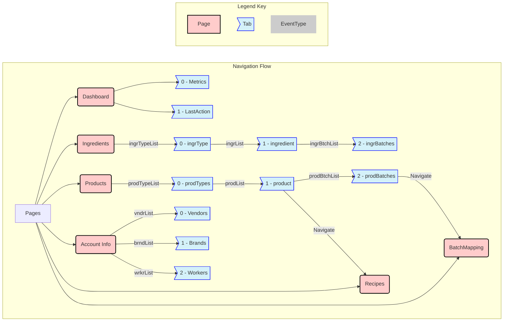

# Client Navigation Flow

## Overview
This document outlines the navigation structure of the WhatFresh client application, showing how pages connect to tabs and how data flows between them via EventTypes.

The client uses a combination of hierarchical and parallel tab navigation patterns, with certain tabs requiring data from parent tabs before they can be fully populated.

## Key Navigation Patterns

### Hierarchical Navigation
The Ingredients and Products pages use hierarchical navigation patterns:
- Parent tabs must be visited first (e.g., ingrType) before child tabs (e.g., ingredient) can be populated.
- EventType keys from parent tabs provides context for child tabs (e.g., selected ingredient type key (ingrTypeID) determines available ingredients).
- This creates a natural workflow from general to specific.

### Parallel Navigation
The Dashboard and Account Info pages use parallel navigation patterns:
- Tabs represent independent views that can be accessed in any order.
- Each tab has its own EventType data flow and is not dependent on other tabs.

### Cross-Page Navigation
Some workflows require moving between pages:
- From Products > product tab to Recipes page (for recipe management)
- From Products > prodBatches tab to BatchMapping page (for detailed batch tracking)
- These transitions maintain context data between pages to ensure continuity.

## State Persistence

- The application maintains tab state when navigating between pages.
- Selected values in parent tabs are preserved when drilling down to child tabs.
- When returning to a previously visited page, the last active tab is restored.
- Cross-page navigation preserves context (e.g., selected product ID when moving to Recipes).

## EventType Relationships

Edge labels in the diagram indicate which EventType powers each tab. For example:
- ingrTypeList → ingrType tab
- ingrList → ingredient tab
- prodBtchList → prodBatches tab

These EventTypes are loaded automatically when navigating to each tab and provide the necessary data for the tab's functionality.