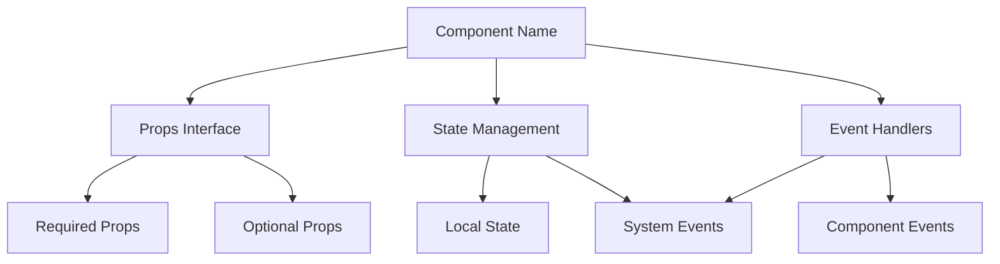

# Component Name

## Overview
Brief description of the component's purpose and role in the application.

## Component Architecture


## Technical Specifications

### Props Interface
| Prop | Type | Required | Default | Description |
|------|------|----------|---------|-------------|
| prop1 | string | Yes | - | Description |
| prop2 | function | No | null | Callback description |

### State Management
#### Local State
```typescript
interface ComponentState {
    loading: boolean;
    error: Error | null;
    data: Array<any>;
}
```

#### External Store Integration
- Store connections
- State updates
- Side effects

### Event Handling
- User interactions
- System events
- Error scenarios

## Implementation Status
- [ ] Component scaffolding
- [ ] Props validation
- [ ] State management
- [ ] Event handlers
- [ ] Error handling
- [ ] Loading states
- [ ] Unit tests

## Testing Requirements
### Unit Tests
- [ ] Props validation
- [ ] State transitions
- [ ] Event handlers
- [ ] Error scenarios

### Integration Tests
- [ ] Store integration
- [ ] Event system integration
- [ ] Parent-child communication

## Related Documentation
- Link to related components
- Link to architectural decisions
- Link to usage examples