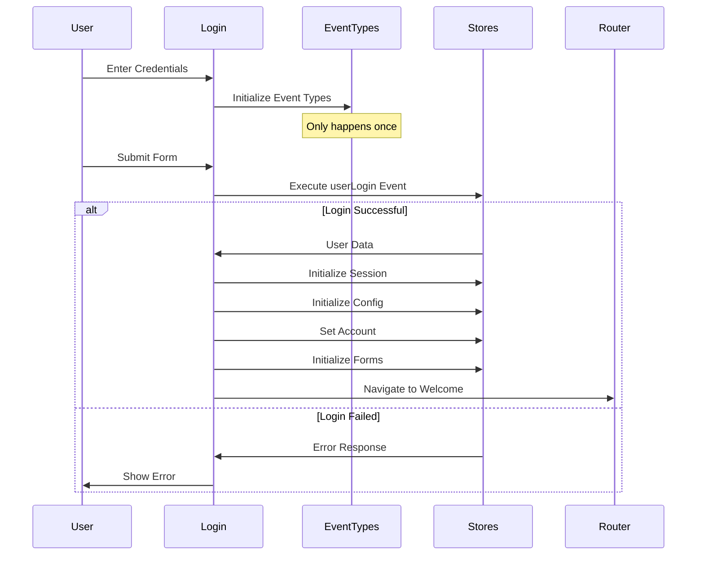

# Login Page

## Flow Overview

## State Management
| Store | Purpose | Initialization Order |
|-------|---------|---------------------|
| Event Types | API Operations | 1 |
| Session | User Session Data | 2 |
| Config | System Configuration | 3 |
| Account | Account-specific Data | 4 |
| Form | Reference Data | 5 |

## Implementation Status
- [x] Event type initialization
- [x] Login form UI
- [x] Credential validation
- [x] Store initialization sequence
- [x] Error handling
- [x] Loading states
- [ ] Password recovery
- [ ] Remember me functionality