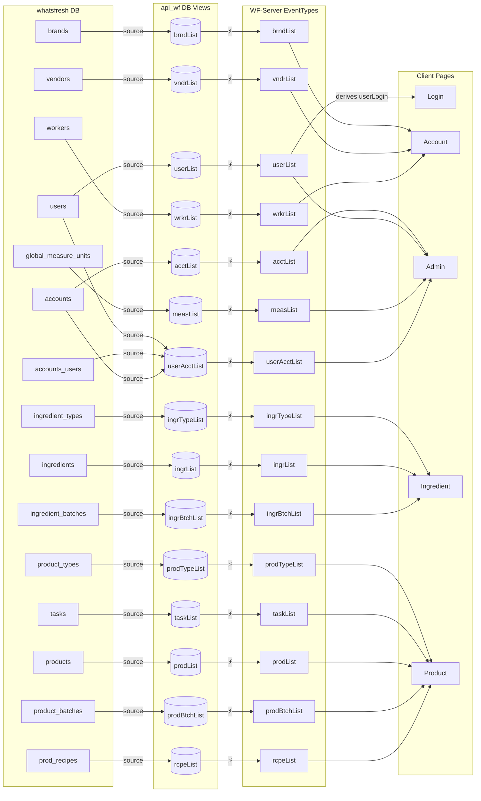

```mermaid
%% Data Flow Diagram with Client Pages
graph LR
    %% Database subgraph
    subgraph WhatsFresh[whatsfresh DB]
        direction LR
        accounts[accounts]
        users[users]
        measures[global_measure_units]
        acc_users[accounts_users]
        ingr_types[ingredient_types]
        brands[brands]
        ingr_batches[ingredient_batches]
        ingredients[ingredients]
        prod_batches[product_batches]
        products[products]
        prod_types[product_types]
        prod_recipes[prod_recipes]
        tasks[tasks]
        vendors[vendors]
        workers[workers]
    end

    %% API Views subgraph
    subgraph API_WF[api_wf DB Views]
        direction LR
        acctList_view[("acctList")]
        userList_view[("userList")]
        measList_view[("measList")]
        ingrTypeList_view[("ingrTypeList")]
        brndList_view[("brndList")]
        ingrBtchList_view[("ingrBtchList")]
        ingrList_view[("ingrList")]
        prodBtchList_view[("prodBtchList")]
        prodList_view[("prodList")]
        prodTypeList_view[("prodTypeList")]
        rcpeList_view[("rcpeList")]
        taskList_view[("taskList")]
        vndrList_view[("vndrList")]
        wrkrList_view[("wrkrList")]
        userAcctList_view[("userAcctList")]
    end

    %% WF-Server EventTypes subgraph
    subgraph WF_Server[WF-Server EventTypes]
        direction LR
        acctList[acctList]
        userList[userList]
        measList[measList]
        ingrTypeList[ingrTypeList]
        brndList[brndList]
        ingrBtchList[ingrBtchList]
        ingrList[ingrList]
        prodBtchList[prodBtchList]
        prodList[prodList]
        prodTypeList[prodTypeList]
        rcpeList[rcpeList]
        taskList[taskList]
        vndrList[vndrList]
        wrkrList[wrkrList]
        userAcctList[userAcctList]
    end

    %% Client Pages subgraph
    subgraph Client[Client Pages]
        direction LR
        Login[Login]
        Account[Account]
        Admin[Admin]
        Ingredient[Ingredient]
        Product[Product]
    end

    %% View to Server mapping (existing arrows)
    accounts --> |"source"| acctList_view
    users --> |"source"| userList_view
    measures --> |"source"| measList_view
    ingr_types --> |"source"| ingrTypeList_view
    brands --> |"source"| brndList_view
    ingr_batches --> |"source"| ingrBtchList_view
    ingredients --> |"source"| ingrList_view
    prod_batches --> |"source"| prodBtchList_view
    products --> |"source"| prodList_view
    prod_types --> |"source"| prodTypeList_view
    prod_recipes --> |"source"| rcpeList_view
    tasks --> |"source"| taskList_view
    vendors --> |"source"| vndrList_view
    workers --> |"source"| wrkrList_view
    users & acc_users & accounts --> |"source"| userAcctList_view

    acctList_view --> |"⚡"| acctList
    userList_view --> |"⚡"| userList
    measList_view --> |"⚡"| measList
    ingrTypeList_view --> |"⚡"| ingrTypeList
    brndList_view --> |"⚡"| brndList
    ingrBtchList_view --> |"⚡"| ingrBtchList
    ingrList_view --> |"⚡"| ingrList
    prodBtchList_view --> |"⚡"| prodBtchList
    prodList_view --> |"⚡"| prodList
    prodTypeList_view --> |"⚡"| prodTypeList
    rcpeList_view --> |"⚡"| rcpeList
    taskList_view --> |"⚡"| taskList
    vndrList_view --> |"⚡"| vndrList
    wrkrList_view --> |"⚡"| wrkrList
    userAcctList_view --> |"⚡"| userAcctList

    %% Server to Client mappings (new)
    userList --> |"derives userLogin"| Login

    brndList --> Account
    vndrList --> Account
    wrkrList --> Account

    acctList --> Admin
    userList --> Admin
    measList --> Admin
    userAcctList --> Admin

    ingrTypeList --> Ingredient
    ingrList --> Ingredient
    ingrBtchList --> Ingredient

    prodTypeList --> Product
    taskList --> Product
    prodList --> Product
    prodBtchList --> Product
    rcpeList --> Product
```