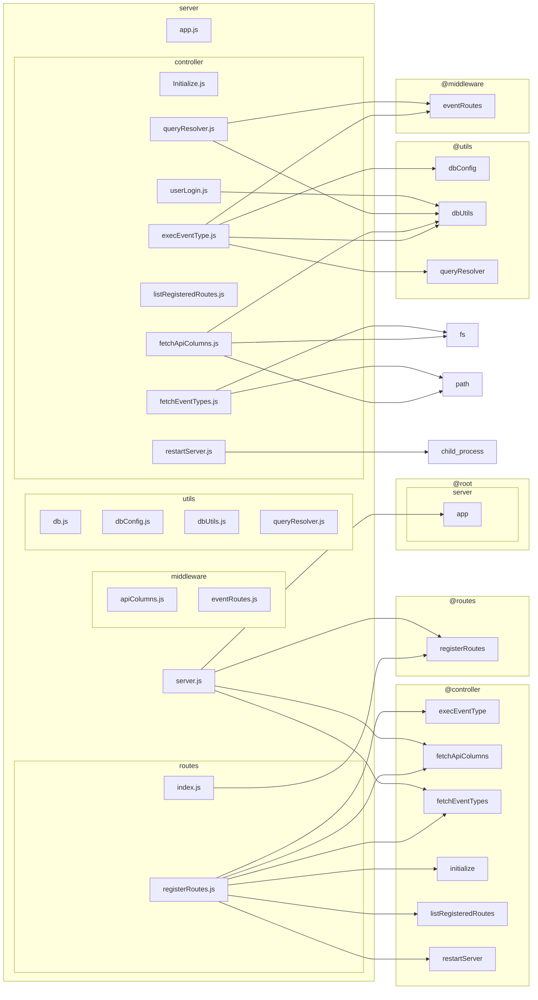

```mermaid
flowchart LR

subgraph 0["server"]
    1["app.js"]
    subgraph 2["controller"]
        3["Initialize.js"]
        4["execEventType.js"]
        B["fetchApiColumns.js"]
        E["fetchEventTypes.js"]
        F["listRegisteredRoutes.js"]
        G["queryResolver.js"]
        H["restartServer.js"]
        J["userLogin.js"]
    end
    subgraph K["middleware"]
        L["apiColumns.js"]
        M["eventRoutes.js"]
    end
    subgraph N["routes"]
        O["index.js"]
        R["registerRoutes.js"]
    end
    Z["server.js"]
    subgraph 13["utils"]
        14["db.js"]
        15["dbConfig.js"]
        16["dbUtils.js"]
        17["queryResolver.js"]
    end
end

subgraph 5["@middleware"]
    6["eventRoutes"]
end
subgraph 7["@utils"]
    8["dbConfig"]
    9["dbUtils"]
    A["queryResolver"]
end
C["fs"]
D["path"]
I["child_process"]
subgraph P["@routes"]
    Q["registerRoutes"]
end
subgraph S["@controller"]
    T["execEventType"]
    U["fetchApiColumns"]
    V["fetchEventTypes"]
    W["initialize"]
    X["listRegisteredRoutes"]
    Y["restartServer"]
end
subgraph 10["@root"]
    subgraph 11["server"]
        12["app"]
    end
end

4-->6
4-->8
4-->9
4-->A
B-->9
B-->C
B-->D
E-->C
E-->D
G-->6
G-->9
H-->I
J-->9
O-->Q
R-->T
R-->U
R-->V
R-->W
R-->X
R-->Y
Z-->U
Z-->V
Z-->12
Z-->Q
```
